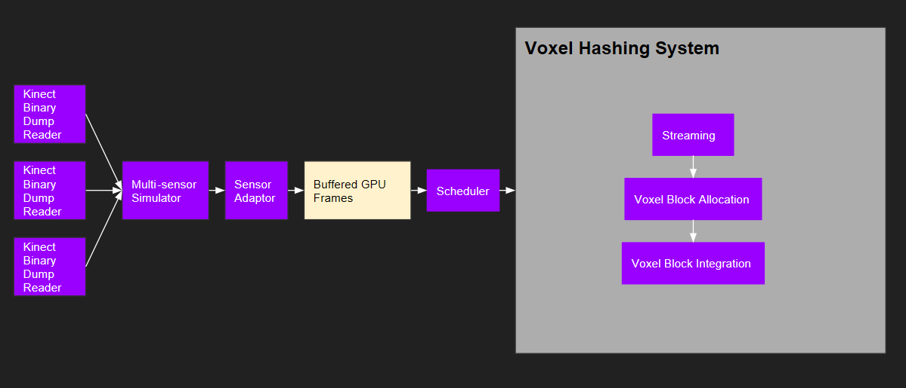

# Multi-Sensor Voxel Hashing

## Background

Voxel Hashing [1] is a system for scalable real-time 3D reconstruction. It is based on Truncated Signed Distance Function (TSDF). It achieves scalability of sensor motion with a sparse representation of the world, i.e., Voxel hash table, and bidirectional streaming of voxel data between GPU and CPU.

## Problem Statement

Though efficient, the Voxel Hashing system [1] is built around a single sensor. In this project, we extended the system to support real-time 3D reconstruction with multiple sensors contributing to the same model. Specifically, we make the following contributions:

1. We demonstrated how a single-sensor system, exemplified by Voxel Hashing, can be adapted to support 3D reconstruction from multiple sensors.

2. We identified the critical performance issues that arise in the presence of multiple sensors.

3. We proposed several techniques to tackle those issues to allow for scalability of multiple sensors, some of which can be directly applied to the original system and are necessarily restricted to multi-sensor scenario.

## System Architecture

In our experiment, we set up several Kinect binary dump readers as our virtual sensors, followed by a multi-sensor simulator which randomly fetch frames from available sensors to simulate what will happen in the real world situtaion.

Because frames coming from different sensors with different size, in the next pipeline stage these frames are resized via re-sampling and are copied into a GPU buffer for further processing. The schedular, given the buffered frames, will make intelligent decisions on the integration strategies including reordering, skipping, etc.

When the integration request is received by the voxel hashing system. We will first perform Host-device voxel streaming. This is because as we are integrating new frames into the model, the size of the voxel blocks will grow too large to fit on GPU.  Active region is defined as a sphere containing the current camera view frustum and a safety region around it. And at each frame the system streams the voxels falling outside the active region to CPU and chunks falling inside the active region to GPU to maintain a minimum working set on GPU. After this step, the voxel hashing system allocates the voxel blocks falling inside the footprint of the depth map being integrated, and perform integration.

## Optimizations

### Baseline

Our baseline solution is to poll all registered sensors in round robin and fetch one frame at a time. The frame is integrated into the voxel model immediately after fetching. This is the most straightforward solution when one wants to integrate all input sensors to a single 3D model at real-time.

### Buffering and Mini-Batch Processing

With this optimization, we maintain a buffer for incoming frames from different sensors
and schedule the whole batch for the integration process.

We find such buffering significantly improves data locality during the integration process,
because the voxel hashing data structures remain in cache across consecutive integration operations.

Buffering also opens opportunities of *reordering* frames for integration. In this project, we consider the following reordering strategies:

1. Random order.

2. Order by sensor ID.

3. Iteratively selecting the frame whose camera position is closest to the last integrated one.

Note that it is not scalable to integrate one frame at a time as the number of sensors increases. Buffering reduces the average integration time per frame and thus allows for better scalability. We can maintain user interactiveness by selecting a proper batch size. Consider a batch size of 30 and three input sensors, where each sensor captures at 30 fps. Then each sensor is buffered for 10 frames, resulting in 1/3 second update latency, which should still be acceptable for user interactiveness.

### Adaptive Streaming

In Voxel Hashing, streaming means to migrate voxel data back and forth between GPU and CPU. Streaming is necessary to achieve scalability of the 3D model size and avoid overflowing the hash table that needs to fit in GPU.

However, we observe that *blind* streaming as in the original system can become a bottleneck and hurt performance. Specifically, when the hash table occupancy is low, the performance gain in hash operations (e.g., shorter bucket linked list) does not compensate the overhead of carrying out streaming.

 We improve it with *adaptive* streaming. That is, we dynamically disable streaming when the hash table occupancy is low and enable it when the occupancy is high.

During reconstruction with multiple sensors, the occupancy of the hash table can vary drastically. The occupancy may be low when several sensors are pointing a the same object. However, occupancy can become *N*x higher if all those sensors are focusing on different scenes. Adaptive streaming strikes a balance between avoiding overflowing the hash table and reducing streaming overhead.

### Heatmap Based Frame Skipping

Lastly, we tackle the situation where the number of input sensors is really large or the compute resource is extremely tight. In such case, we do not have enough resources to process every frame from every sensor. We need to smartly discard some frames from our workload.

Skipping frames brings about chances of losing quality. To minimize quality loss, we develop a heatmap based frame skipping algorithm. Intuitively, we skip a frame when the region in its frustum has been updated frequently and recently, meaning the reconstructed model in that region is "good enough". Skipping is usually triggered when a sensor has stayed still for a short while, or goes back to a previously visited scene, or moves to a scene that has been scanned by another sensor.

We maintain a 3D heatmap on host CPU. It divides the world into uniform 3D chunks, each with a heat value. When a frame is scheduled for integration, it increases the heat values in its chunks. Heat value decays over time naturally. When frame skipping is enabled, we dynamically check each frame's heat value and skip integrating it if its heat value is higher than a threshold. Experiments show that quality loss is minimal with heatmap based frame skipping.

Above: Reconstruction **without** frame skipping

Above: Reconstruction **with** frame skipping

## Results

### Demo

https://vimeo.com/195757597

### Experiments

Below is the experiment result of running a test with ~300 input frames.

The *baseline* is to poll each connected sensor round robin and integrate one frame at a time.
As can be seen from the rightmost column, each of the three major optimizations, aka *buffering*, *adaptive streaming* and *frame skipping* brings about ~25% reduction of time, resulting in 75% reduction in total (**4x speedup**).

| Optimization | Integration (ms) | Streaming (ms) | Total (ms) | Reduce baseline by (%) |
|:-------------|:----------------:|:--------------:|:----------:|:----------------------:|
| Baseline (1 frame RR) | 1784 | 2348 | 4132 | 0% |
| Buffering (30 frames) | 1423 | 1711 | 3134 | 24.15% |
| &nbsp;&nbsp;  + Order by sensor   | 1443 | 1501 | 2944 | 28.75% |
| &nbsp;&nbsp;  + Closest camera pos | 1439 | 1817 | 3256 | 21.20% |
| + Adaptive streaming | 1460 | 480 | 1940 | 53.05% |
| + Frame skipping | 865 | 168 | 1033 | **75.00%** |

We find that buffering alone has significantly improved cache locality. So further reordering frames within a batch merely yields marginal gains. Adaptive streaming reduces the streaming time to ~1/3 (1711 -> 480) by saving a lot of unnecessary streaming, with a slight increase of integration time (1423 -> 1460). Frame skipping brings about the last 22% reduction by skipping the work to integrate some frame entirely.

Reference:

[[1] Nießner, M., Zollhöfer, M., Izadi, S., & Stamminger, M. (2013). Real-time 3D reconstruction at scale using voxel hashing. ACM Transactions on Graphics (TOG), 32(6), 169.](http://www.graphics.stanford.edu/~niessner/niessner2013hashing.html)
